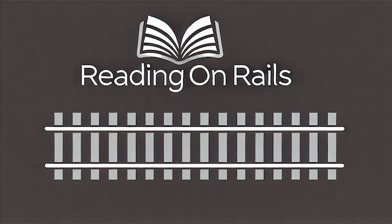

# README

# Reading on Rails App

## Overview

Reading on Rails is a simple book review and tracking app. Users can add books they'd like to read or have recently read to their profiles. Users can also leave reviews and star ratings for the books they add to their profiles.

## Table of Contents

- Features
- Installation
- Getting Started/Installation
- Usage
- RSpec Tests

## Features

### Authentication Through Devise

- **Sign Up**: Users can create an account.
- **Log In**: Users can log in with their credentials.
- **Log Out**: Users can log out of their account securely.

### Homepage

- **Link to Profile**
- **Link to Find Books**

### Profile

- **Add Avatar**: Users can upload a profile avatar of their choice through use of active storage.
- **Bio**: User information (first/last name, member since) are displayed
- **Favorite Genres**: Users can select their favorite genres and display them on their profile. Favorite Genres are editable through the same link.
- **My Books**: Users can display their books they've added to their account on their profile. Each book title is a link to the book show page where a user can read and write reviews of the book.

### Leave a Review

- **Review**: Users are allowed to review any book, once. The button to take users to the new review form is conditionally rendered by whether the user has a review associated to this book. If not, they may review the book.

### Find Books

- **Search**: Users can search books by title or author.
- **Add To List**: Users can add a book to their list which will display on their profile. When the book is added, they will be redirected to their profile. A user can only add a particular book to their list once. The button to 'Add To List' will not be rendered once there is a user_book association.
- **Book Covers**: Book covers are visible through active storage/seed data.

### Update User Credentials Through Devise

- **Account Settings**: Users can edit their account information through the account settings link. Users can change their email, password, first name, and or last name.

## Getting Started

## Installation

### Ruby Version Required

- `ruby "3.0.6"`

### Setup

1. Clone the repository:

   - `git clone git@github.com:gabbymassaro/rails_project.git`
   - `cd rails_project`
   - `cd rails_project`

2. Install dependencies

   - `bundle install`

3. Set up the database

   - `bin/rails db:migrate`
   - `bin/rails db:seed`

4. Start server
   - `bin/rails s`

## Usage

Once the application is set up, you can access it at http://localhost:3000.

## RSpec Tests

### Model Tests

- rspec ./spec/models/books_spec.rb
- rspec ./spec/models/factories_spec.rb
- rspec ./spec/models/genres_spec.rb
- rspec ./spec/models/reviews_spec.rb
- rspec ./spec/models/user_books_spec.rb
- rspec ./spec/models/user_genres_spec.rb
- rspec ./spec/models/users_spec.rb

### Feature/Integration Tests

- rspec ./spec/features/new_review_spec.rb
